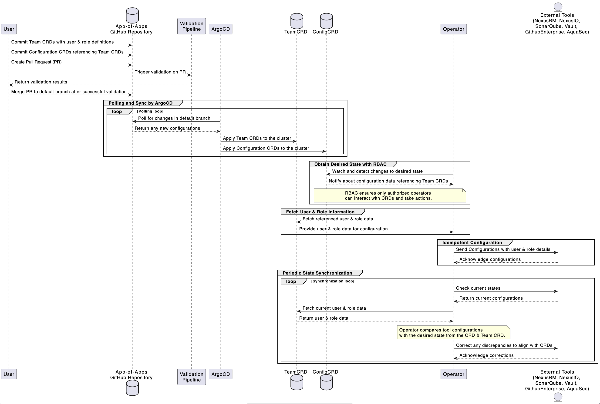

# Design Proposal: Transitioning to Kubernetes Operator Pattern with CRDs

* * *

**1\. Objective**
-----------------

To migrate our current Tekton pipeline system, which uses a YAML configuration manifest, to a Kubernetes Operator pattern that leverages Configuration and Team Custom Resource Definitions (CRDs).

* * *

**2\. Current Solution**
------------------------

Currently, we employ a Tekton pipeline that consumes a YAML configuration manifest detailing the desired state of tools like NexusIQ, NexusRM, Vault, ArgoCD, Webhook Registration, etc.

* * *

**3\. Proposed Solution**
-------------------------

Use Kubernetes Operators combined with CRDs to manage and maintain the configuration state for our tools. This includes:

*   Configuration CRD: Manages tool configurations.
    
*   Team CRD: Contains user and role data for RBAC setups in tools.
    

* * *

### **3.1 Process Flow**

* * *

**4\. Advantages over Current Solution**
----------------------------------------

1.  **Centralized Management**: CRDs provide a single source of truth for configurations and user roles.
    
2.  **Declarative Configuration**: Desired states are clearly defined, making configuration transparent and understandable.
    
3.  **Scalability**: Kubernetes Operators can be scaled easily, allowing us to manage more tools without a linear increase in complexity.
    
4.  **Autonomous Operation**: Operators continually ensure that the actual state matches the desired state without manual intervention.
    
5.  **Streamlined RBAC**: With the Team CRD, RBAC setup across tools becomes consistent and centralized.
    
6.  **GitOps Integration**: Integration with ArgoCD and app-of-apps repository ensures version-controlled, auditable, and automated deployment and rollback capabilities.
    

* * *

**5\. Disadvantages & Concerns**
--------------------------------

1.  **Complexity**: While Operators automate many tasks, their internals and CRD integrations can be complex.
    
2.  **Network Overhead**: Continual polling and synchronization can increase network traffic.
    
3.  **Dependency on Kubernetes**: This solution ties the configuration management closely with Kubernetes.
    

* * *

**6\. Risks & Mitigation**
--------------------------

1.  **Divergent States**: The risk of configuration drift between the CRD and external tools.
    
    *   _Mitigation_: Operators will continually synchronize and correct any discrepancies.
        
2.  **Overloading External Tool APIs**: Excessive checks and updates might overload the tool APIs.
    
    *   _Mitigation_: Implement optimized polling intervals and caching.
        
3.  **Unauthorized Access**: Incorrect configurations might expose sensitive operations.
    
    *   _Mitigation_: Employ strong RBAC policies in Kubernetes and restrict access to CRDs.
        
4.  **Misconfigurations**: As configurations are automated, incorrect CRDs can propagate errors rapidly.
    
    *   _Mitigation_: Implement robust validation pipelines before CRD changes are accepted.
        

* * *

**7\. Conclusion**
------------------

Transitioning to a Kubernetes Operator pattern with CRDs introduces a robust, scalable, and automated system for configuration management. While it comes with its learning curve and complexities, the benefits in terms of scalability, automation, and centralized management make it a compelling choice.

* * *
